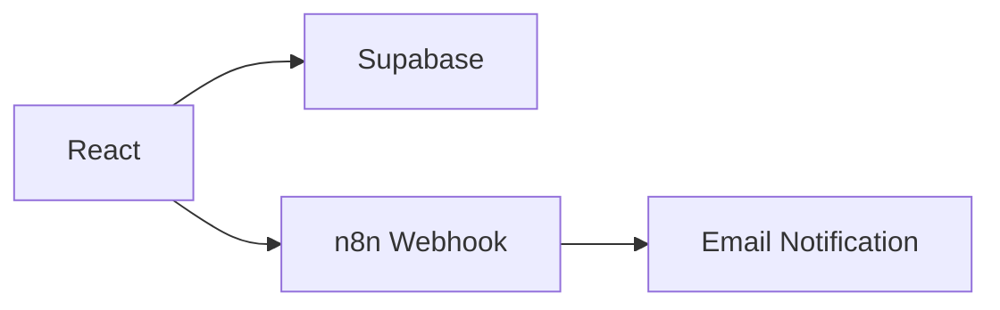

# FitScore


<h1 align="center">
 <a href="https://desafio-dev-legal-fit-score.vercel.app/">website view - FitScore </a>
</h1>

# 🎯 Mini FitScore™ - PSL LEGAL

> Versão simplificada do algoritmo FitScore™ para avaliação de candidatos com base em **Performance**, **Energia** e **Cultura**.

## 🚀 Deploy
- **Página**: [Mini FitScore™](https://desafio-dev-legal-fit-score.vercel.app/)


## 🏗️ Arquitetura



## 🏗️ Diagrama da Arquitetura da Aplicação


## 🏗️ Diagrama da Arquitetura da Aplicação - Lógica 1 — Notificação de Resultado


## 🏗️ Diagrama da Arquitetura da Aplicação - Lógica 2 — Relatório de Aprovados


<!-- Tecnologias utilizadas no projeto -->

### Tecnologias

<div align="center">

  [](https://skillicons.dev) 
  
  
</div>

### Componentes
- **Frontend**: React + TypeScript + Tailwind
- **Backend**: Supabase (PostgreSQL)
- **Processamento Assíncrono**: n8n.cloud
- **Notificações**: SMTP (Gmail)

## 📊 Fórmula FitScore™
### Classificações
- **≥ 80**: Fit Altíssimo 🏆
- **60-79**: Fit Aprovado ✅
- **40-59**: Fit Questionável ⚠️
- **< 40**: Fora do Perfil ❌

## 🔄 Lógicas de Negócio Assíncronas

### 📧 Lógica 1 - Notificação de Resultado
**Trigger**: Envio do formulário
```
Formulário → Supabase → Webhook n8n → Email personalizado
```

**Funcionamento**:
1. Dados salvos no Supabase
2. Webhook disparado para n8n
3. Classificação analisada
4. Email customizado enviado ao candidato

## 🛠️ Setup Local

### Pré-requisitos
- Node.js 18+
- Conta Supabase (free)
- Conta n8n.cloud (free)

### 1. Clone e instale
```bash
git clone https://github.com/
cd mini-fitscore
npm install
```

### 2. Configure Supabase
```sql
-- Execute no SQL Editor do Supabase
CREATE TABLE candidatos (
  id BIGSERIAL PRIMARY KEY,
  name TEXT NOT NULL,
  email TEXT NOT NULL,
  fit_score INTEGER NOT NULL,
  classification TEXT NOT NULL,
  created_at TIMESTAMP WITH TIME ZONE DEFAULT NOW()
);

-- Execute no SQL Editor do Supabase
ALTER TABLE candidates ENABLE ROW LEVEL SECURITY

-- Permitir leitura para todos os usuários autenticados:
CREATE POLICY "Allow authenticated users to read candidates" ON candidates
FOR SELECT
TO authenticated
USING (true);

-- Permitir inserção para usuários autenticados
CREATE POLICY "Allow authenticated users to insert candidates" ON candidates
FOR INSERT
TO authenticated
WITH CHECK (true);

-- Permitir atualização para usuários autenticados
CREATE POLICY "Allow authenticated users to update candidates" ON candidates
FOR UPDATE
TO authenticated
USING (true);

-- Permitir exclusão para usuários autenticados
CREATE POLICY "Allow authenticated users to delete candidates" ON candidates
FOR DELETE
TO authenticated
USING (true);
```

### 3. Variáveis de Ambiente
```bash
# .env.local
REACT_APP_SUPABASE_URL=https://seu-projeto.supabase.co
REACT_APP_SUPABASE_ANON_KEY=sua_chave_publica

 -- Dentro da pasta services, crie um arquivo chamado supabase.ts com o seguinte conteúdo
import { createClient } from "@supabase/supabase-js";

const supabaseUrl = import.meta.env.VITE_SUPABASE_URL as string;
const supabaseAnonKey = import.meta.env.VITE_SUPABASE_ANON_KEY as string;

export const supabase = createClient(supabaseUrl, supabaseAnonKey);

-- Instale o pacote @supabase/supabase-js
npm install @supabase/supabase-js

 -- criar seu arquivo .env (Essas informações tem no Supabase)
VITE_SUPABASE_URL=https://kezxiksdbqzqcsc****
VITE_SUPABASE_ANON_KEY=eyJhbGc**********

-- No arquivo onde você deseja usar o Supabase (ex.: src/main.tsx), importe o client
import { supabase } from "../../services/supabase";

async function fetchCandidates() {
  const { data, error } = await supabase.from('candidates').select('*');
  if (error) console.error('Erro:', error);
  else console.log('Candidatos:', data);
}
fetchCandidates();
```

### 4. Execute
```bash
npm start
```

## 🔧 Configuração n8n

### Workflow 1 - Notificações
- **URL**: `/webhook/candidate-evaluation`
- **Método**: POST
- **Dados**: candidato, scores, classificação

### Workflow 2 - Relatórios
- **Trigger**: Schedule (12h)
- **Query**: `****'`
- **Output**: Email HTML com estatísticas

### Credenciais necessárias
1. **Supabase**: Host + Service Role Key
2. **SMTP**: Gmail com senha de app

### Funcionalidades mostradas:
- ✅ Formulário multi-step responsivo
- ✅ Cálculo em tempo real do FitScore
- ✅ Persistência no Supabase
- ✅ Notificação automática por email (Notifica somente para os aprovados, então esta 90%)
- ✅ Dashboard de candidatos
- ⚠️ Relatório automatizado (Estou debugando)

## 🧪 Decisões Técnicas

### Frontend
- **React**: Componentização e estado reativo
- **TypeScript**: Type safety
- **Tailwind**: Design system consistente
- **Multi-step Form**: UX aprimorada

### Backend & Processamento
- **Supabase**: Simplicidade e RLS
- **n8n**: Visual workflow, fácil manutenção
- **Webhooks**: Desacoplamento e escalabilidade


## 👨‍💻 Layout

### Página - Formulário FitScore


### Página - Dashboard


